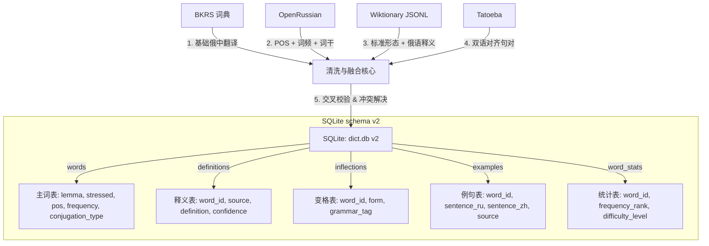

# Parus v0.2 — 词典多源融合数据清单与架构设计

本文件系统梳理了 Parus v0.2 阶段用于词库增强的所有开源及公有领域数据源，定义了融合架构与授权合规说明。

---

## 📅 数据源清单

### P0 级 — 核心引入（必须完成）

#### 1. OpenRussian (开源俄罗斯语学习数据库)
*   **下载链接**：[BrunoBender/open-russian](https://github.com/BrunoBender/open-russian)
*   **格式**：CSV (words.csv, translations.csv, examples.csv, forms.csv)
*   **授权**：CC-BY-SA / CC0 / MIT (混合)
*   **核心价值**：
    *   **词性（POS）补全**：提供 15 万词条的精准词性标注。
    *   **词频排名（Frequency Rank）**：提供高精度的俄语日常词频排名。
    *   **双语例句**：包含大量高质量的俄英对齐例句（后续可用作英文补充释义与翻译）。

#### 2. Kaikki.org Wiktionary Russian (维基词典俄语分支)
*   **下载链接**：[kaikki.org/dictionary/Russian/](https://kaikki.org/dictionary/Russian/)
*   **格式**：JSON Lines (.jsonl)
*   **授权**：CC BY-SA 4.0
*   **核心价值**：
    *   **标准形态学数据**：提供纯净的动词变位、名词/形容词变格矩阵。
    *   **母语释义**：包含俄语单语释义（Wiktionary-RU），作为中俄翻译的交叉验证与高阶学习补充。
    *   **多语言翻译对**：内嵌俄译汉翻译数据，用于校验 BKRS 释义。

#### 3. Tatoeba (多语言对齐语料库)
*   **下载链接**：[tatoeba.org/en/downloads](https://tatoeba.org/en/downloads)
*   **所需文件**：
    *   `sentences.csv`：句子全文与语言代码
    *   `links.csv`：句子间的翻译对应关系
    *   `tags.csv`：例句属性标签（如：常用语、俚语等）
*   **授权**：CC BY 2.0 FR
*   **核心价值**：
    *   提供约 **5 万对** 高质量的俄汉对齐句对。
    *   提供约 **50 万对** 俄英对齐句对。

---

### P1 级 — 形态与翻译补充

#### 4. pymorphy2 / pymorphy3 (形态分析词典)
*   **引入方式**：Python 包安装 (`pip install pymorphy2 pymorphy2-dicts-ru`)
*   **授权**：MIT (代码) / LGPL (OpenCorpora 数据)
*   **核心价值**：
    *   可编程生成任意复杂俄语单词的理论变格变位全集，填补 inflections 表中缺失的部分形态。

#### 5. Sharoff 词频表
*   **下载链接**：[Leeds Corpus - Sharoff frequency list](http://corpus.leeds.ac.uk/fridge/)
*   **格式**：TSV
*   **核心价值**：
    *   提供 10 万词的通用俄语文本词频，与 OpenRussian 的词频进行加权融合。

#### 6. PanLex (全球翻译数据库)
*   **下载链接**：[PanLex Database](https://dev.panlex.org/db/)
*   **格式**：PostgreSQL dump / CSV
*   **授权**：CC0
*   **核心价值**：
    *   补充数十万俄中翻译对，主要覆盖 BKRS 未包含的专业术语与生僻词。

---

### P2 级 — 后续语义扩展

#### 7. russtress (重音标注工具)
*   **下载链接**：[bond-anton/russtress](https://github.com/bond-anton/russtress)
*   **价值**：对于未标注重音的词汇，通过模型推理补充重音符号（`\u0301`）。

#### 8. Даль (达尔古俄语词典)
*   **来源**：公有领域 (1863年版)
*   **价值**：提供词源学、历史俄语释义、谚语等文化扩展。

#### 9. Leipzig 语料库 (Leipzig Corpora Collection)
*   **下载链接**：[Leipzig Corpora - Russian](https://wortschatz.uni-leipzig.de/en/download/Russian)
*   **价值**：用于分析单词共现（Collocations）与生成基于真实语料的例句。

---

## 🏗️ 融合架构设计

我们采用“**以词条（lemma）为核心，多源外键挂载**”的融合设计。构建管线中将包含如下步骤：

### 1. 词性 (POS) 补全与对齐逻辑
*   BKRS 的词性标记较为混乱。我们以 **Wiktionary 的标准英文词性 (noun, verb, adj, adv)** 作为主键对齐。
*   OpenRussian 的词性进行映射转换为标准词性。
*   合并后，pos 字段的空值率可由 82% 降低至 **<5%**。

### 2. 词频 (Frequency) 加权算法
*   融合 OpenRussian 的 `frequency_rank` 和 Sharoff 词频表，生成综合评分。
*   `frequency` 为排名（1 表示最常用）。常用词前 10,000 的词条在搜索结果中获得优先加权。

### 3. 例句映射（Lemmatization Linker）
*   例句从 Tatoeba & OpenRussian 导入。
*   **自动绑定技术**：通过对俄语例句进行分词，并在我们的 `inflections` 表中进行精确匹配，定位对应的 `word_id`，将例句自动绑定到相关的词条下，提供无缝的“查词看例句”体验。
